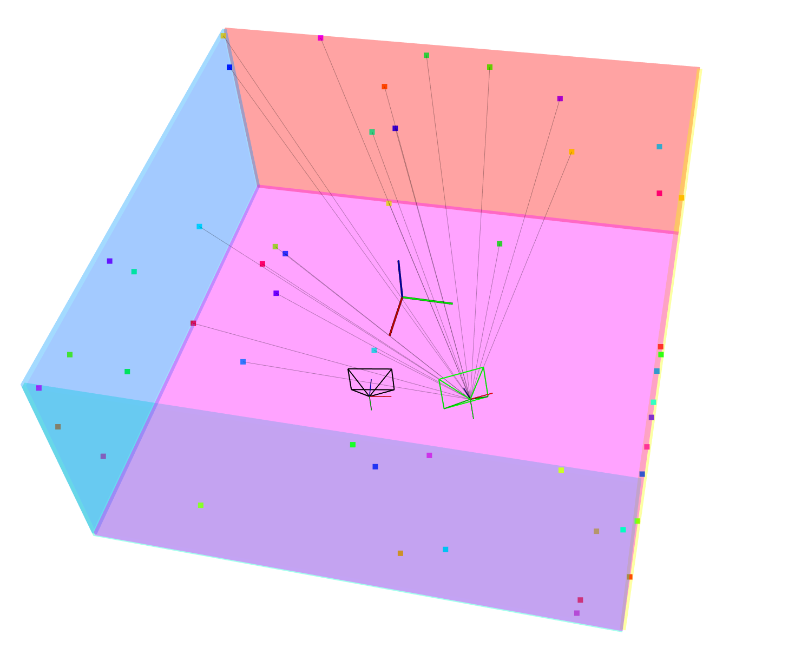

# Slam-Scene-Viewer

<b><i>Attention</i></b>

The current library **is not maintained and is very outdated**. We **strongly recommend** you to use our new pangolin-based visualization library: [**tiny-viewer**](https://github.com/Unsigned-Long/tiny-viewer.git)! May **tiny-viewer** be with you!!!

## 1. Overview

Try to draw sample but beautiful objects in the pcl scene viewer!

## 2. Display

